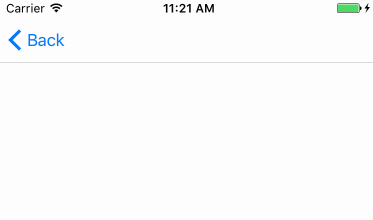

[](https://travis-ci.org/WXGBridgeQ/SwiftPullToRefresh)
[](https://github.com/Carthage/Carthage)
[](https://cocoapods.org/pods/SwiftPullToRefresh)
[](https://cocoapods.org/pods/SwiftPullToRefresh)
[](https://swift.org/)
[](https://github.com/WXGBridgeQ/SwiftPullToRefresh/blob/master/LICENSE)

# SwiftPullToRefresh

An easy way to implement pull-down-to-refresh and pull-up-to-load-more feature based on UIScrollView extension, written in Swift 3.

Supply default style header and footer controls which you can directly use in your project, and also support for customization. GIF is also supported.

## Example usage

#### Indicator Header

```swift
scrollView.spr_addIndicatorHeader { [weak self] in
    // do your action here
    // self?.scrollView.spr_endRefreshing()
}
```


#### Text Header

Text, font, color can be customized.

```swift
scrollView.spr_addTextHeader { [weak self] in
    // do your action here
    // self?.scrollView.spr_endRefreshing()
}
```


#### Small GIF Header

```swift
scrollView.spr_addGIFHeader(data: data, isBig: false, height: 60) { [weak self] in
    // do your action here
    // self?.scrollView.spr_endRefreshing()
}
```


#### GIF + Text Header

```swift
scrollView.spr_addGIFTextHeader(data: data) { [weak self] in
    // do your action here
    // self?.scrollView.spr_endRefreshing()
}
```



#### Big GIF Header

```swift
scrollView.spr_addGIFHeader(data: data, isBig: true, height: 120) { [weak self] in
    // do your action here
    // self?.scrollView.spr_endRefreshing()
}
```


#### SuperCat Header (Inspired by [RayWenderlich](https://videos.raywenderlich.com/courses/68-scroll-view-school/lessons/18))

```swift
scrollView.spr_addSuperCatHeader { [weak self] in
    // do your action here
    // self?.scrollView.spr_endRefreshing()
}
```


#### Indicator Footer

```swift
scrollView.spr_addIndicatorFooter { [weak self] in
    // do your action here
    // self?.scrollView.spr_endRefreshing()
}
```


#### Text Footer

```swift
scrollView.spr_addTextFooter { [weak self] in
    // do your action here
    // self?.scrollView.spr_endRefreshing()
}
```


## Demo

Open and run the SwiftPullToRefreshDemo target in Xcode to see SwiftPullToRefresh in action.

## Requirements

* iOS 8.0
* Swift 3.0

## Installation

#### CocoaPods

```
use_frameworks!
pod 'SwiftPullToRefresh'
```

#### Carthage

```
github "WXGBridgeQ/SwiftPullToRefresh"
```

#### Manual

Add SwiftPullToRefresh folder into your project.

## Customization

The framework is very easy to customize the use.

You just need to subclass the `RefreshHeaderView` or `RefreshFooterView ` and implement the methods below, then call `spr_addCustomHeader(headerView:)` or `spr_addCustomHeader(headerView:)` to add it to your scrollView.

```swift
class CustomHeader: RefreshHeaderView {
    override func updateRefreshState(_ isRefreshing: Bool) {
        // customize your view display with refresh state here
    }
    
    override func updateProgress(_ progress: CGFloat) {
        // customize your view display with progress here
    }
}

class CustomFooter: RefreshFooterView {
    override func updateRefreshState(_ isRefreshing: Bool) {
        // customize your view display with refresh state here
    }
    
    override func updateProgress(_ progress: CGFloat) {
        // customize your view display with progress here
    }
}
```

## Contribution

You are welcome to contribute to the project by forking the repo, modifying the code and opening issues or pull requests.

## License

Available under MIT license. See the [LICENSE](https://github.com/WXGBridgeQ/SwiftPullToRefresh/blob/master/LICENSE) for more info.